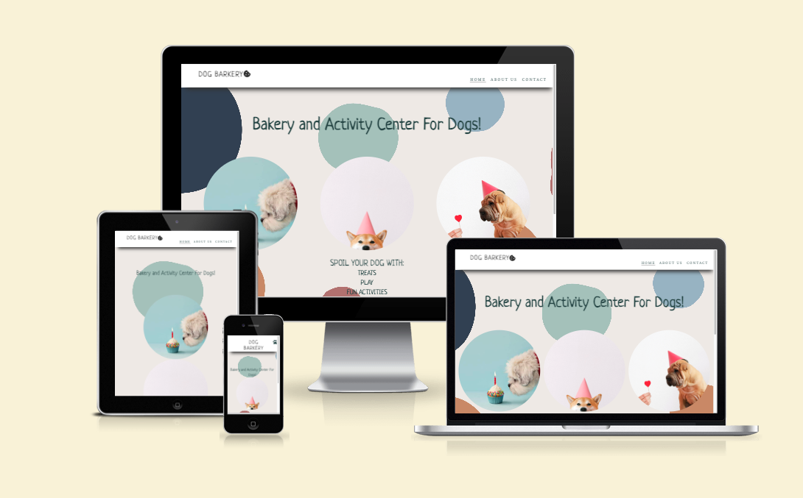
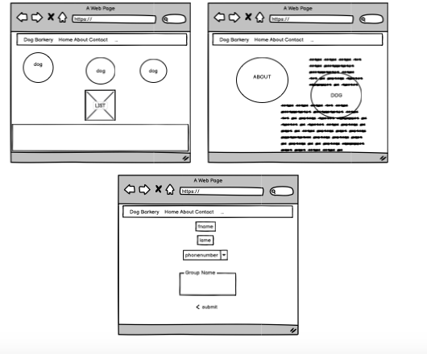
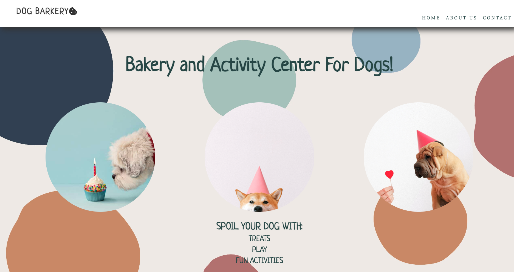
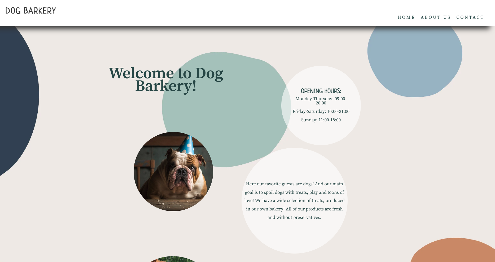
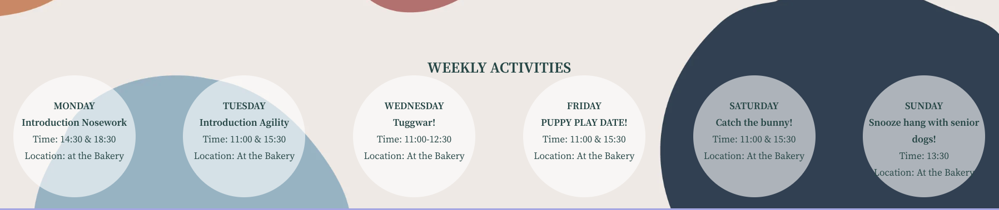
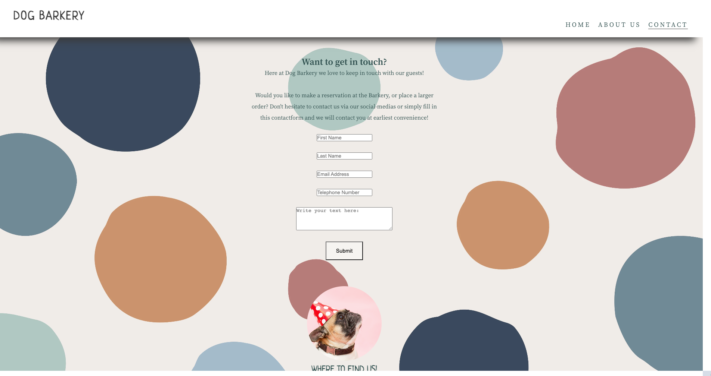

# Dog Barkery

Dog Barkery is a website that aspires to attract more people to their bakery and activity center, Dog Barkery. The site informs guest about opening times, weekly schedule and location. The main purpose of this site is to find people who love dogs and wants to activate their dogs together with likeminded people.

## Design

The main goal with the design of this website was to make it look fun and inviting. By using Balsamic Wireframe the basic structure of Dog Barkery was created. The pictures in the website that has been used are fun to look at but also clean and colorful. The dotted background was choosen because it had a very nice color palette and the dots matched the over all circle style of the website. A couple of divs along with all pictures were put inside circles. This was done to make the website playful and easy on the eye.

## Features

### Existing Features

1. The landing page

- The landing page contains information about what the purpose of Dog Barkery is. It contains images of dogs to immediately create a connection to what the website is about.
- There is a short list called "Spoil your dog" wich displays that there are treats, play and fun activities for dogs. It is a way to show guests that the Dog Barkery is all about dogs.

2. Navigation Bar

- To make it easy for the user of this website to find correct information, there is a navigation bar that displays the Home, About and a Contact. The navigation menu is full responsive and also contains the Dog Barkery logo. There is no need for the user to use the 'back' button since navigation menu allows easy access to all three pages.

3. The Footer

- The footer section contains links to Dog Barkerys social medias (Facebook, Instagram and Youtube). The links open in a new tab to make it easier for the user to control the websites.
- The social medias displays pictures from Dog Barkery and activities to allure people to pay a visit.

4. About Us

- The About Us page is where information about schedule and opening times are stored. There is also a brief section about who the owner of Dog Barkery is and why the company was established. This is to create a more personal feeling to the website and to make it more inviting.

- In the weekly schedule there is information about what kind of activity that are happening during the week including weekdays, time and place. This will attract people who might be interested in trying some new activities. It also sends information about what weekdays are more suitable for puppy's or senior dogs.

- Opening times displays when Dog Barkery is open.

1. Contact

- This page let's the user know how to contact Dog Barkery. If the user doesn't want to contact via social medias there is a contact form that is easy to use and will let the user know what kind of inputs are needed. The inputs have a hover function to make it easy for the user to click inside the boxes. The submit button has been enlarged to make it more accessible. The user needs to enter first name, last name and email. In the bottom of the page there is a map to Dog Bakerys location. 

### Features Left to Implement

* Have recipes of different dog treats that are suitable for people to make at home.

* Have a fourth page with a gallary. Showing pictures from weekly activities at Dog Barkery.

## Technologies used

- HTML
- CSS
- Github
- Codeanywhere
- W3C:s CSS-validator
- WRC:s HTML validator
- Lighthouse
- Balsamiq Wireframes
  

## Testing

The website has been tested with Google DevTools. Different screen sizes has been tested to work on all devices. Functions of navbar has been adjusted to act as a toggle-bar on smaller devices, while on big screens it appers in the header to the right.

The testing with Google DevTools has helped to localise problems with responsiveness. To solve these problems, media queries has been used for devices with (min-width: 768px) and (min-width: 900px).

There are some estetic malfunctions with the toggle-bar. On smaller screens, when the toggle-menu is clicked, the menu takes up to much space on the left side. This issue will be fixed with adding some padding on the left side. The malfunction is under process.

### Validator Testing

- HTML
  - No errors were returned when passing through the official W3C validator.
  
- CSS
  - No errors were found when passing through the official (Jigsaw) validator.

- Lighthouse testing
  
<!---Add picture from lighthouse and validator testing html css--->

### Unfixed Bugs

1. Footer buttons
  
  * Description: There has been some issues with placement of the footer icons with the links to Facebook, Instagram and Youtube. The placement is intended to spread out evenly, but the icons stick together at the moment.
* Status: The issue is under investigation.

2. Toggle-menu
  * Description: The toggle-menu as mentioned previously in the testing section has some estetic malfunction. The issue is believed to have to do with padding on the left side.
  * Status: In progress.

## Deployment

This website has been deployed to Github pages. The deployment process starts at GitHub repository and from there navigate to Settings tab. In the dropdown menu scroll down to Pages. Inside the Pages tab, choose Source, Deploy from branch. Under branch, enter main and / (root). Enter save. When the site is deployed there will be a ribbon.
The live link can be found here: 

<!---Enter code to live website----->

## Credits 

* Content
  * The Favicons in the header and footer menu comes from the website Font Awesome.
  * Instructions on how to add hover function has been taken from the website W3 Schools.
  * Instructions on how to add a picture into a circle shape comes from The love Running project at Code Institute.
  * Information on how to built a website has been learned with Love Running project at the Code Institute.
  * Fonts have been imported from Google fonts.

* Media Images
  *  Pexels
     *  bulldog-sitting-wooden-table
     *  dog with lollipop
     *  french bulldog
     *  peeking dog
     *  two dogs with party hat

  * Istock Photo
    * white dog with cupcake
  
  
  * Google Photo:  
    *   The dotted background can be found with this link: <https://images.app.goo.gl/eT2BWZFSF6MCSRWF6>.
  
* Extra credits
  * Code Institute tutorials
  * Mentor Brian O'Hare
  * Slack channels along with my peers and their discussions and analysis
  * My friend Annika Davies
  * W3 Schools
  * Google search
  